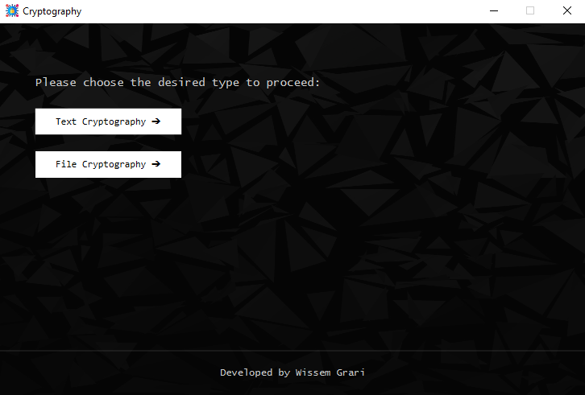
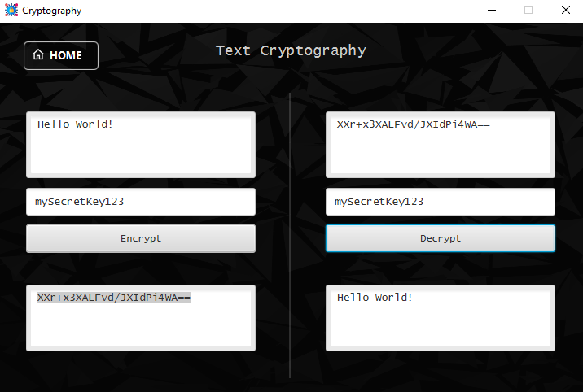
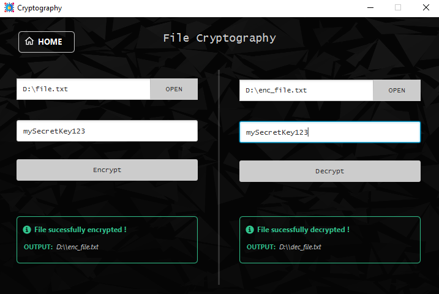

## Overview

Cryptography is a Java-based project that utilizes JavaFX for the graphical user interface. The application provides
text and file cryptography using the AES (Advanced Encryption Standard) algorithm.


<div style="display: flex; gap: 5px; flex-wrap: nowrap;">
  
   
</div>

## Prerequisites

- JDK 21 or later
- Maven 3.6.0 or later

### Setup

1. **Clone the repository:**
   ```sh
   git clone https://github.com/wissemgrari/java-fx-cryptography.git
   cd java-fx-cryptography
   ```
2. **Build the project:**
   ```sh
   ./mvnw clean install
   ```
3. **Run the application:**
   ```sh
   ./mvnw javafx:run
   ```

### Project Structure

* ```src/main/java```: Contains the main application source code.
* ```src/main/resources```: Contains the application resources.
* ```src/test/java```: Contains the unit tests.

### Dependencies

* JavaFX Controls
* JavaFX FXML

### Configuration

The project uses the `javafx-maven-plugin` to handle JavaFX dependencies and execution. Ensure the `pom.xml` is
correctly configured with the necessary dependencies and plugins.

### License

This project is licensed under the MIT License. See the `LICENSE` file for details.
